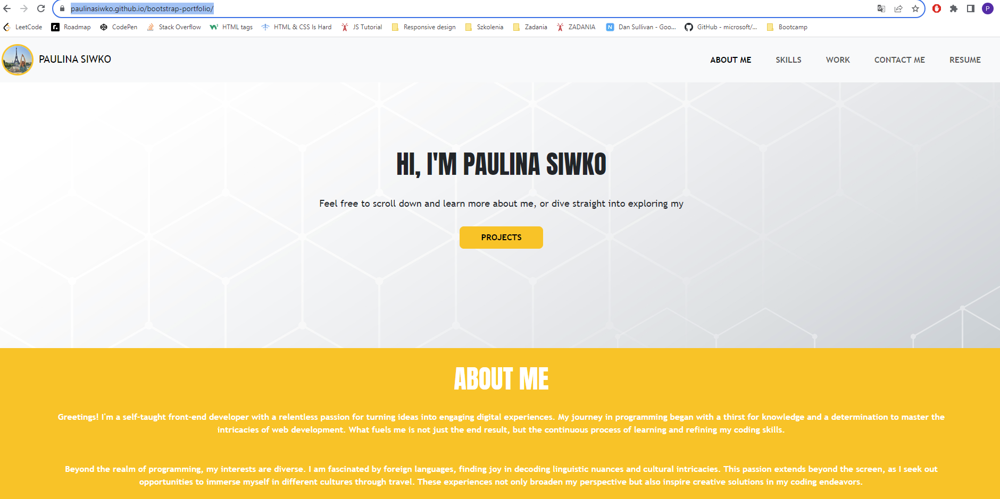

# bootstrap-portfolio

## Description
This project serves as my portfolio webpage, showcasing my various projects. The portfolio was created using **Bootstrap 5**. The repository includes HTML and CSS files. CSS was used to overwrite Bootstrap 5 CSS file to create a visually appealing webpage. The primary purpose of this portfolio is to provide a centralized platform for displaying my projects, top skills and sharing my contact information. By maintaining this deployed webpage, I aim to present a comprehensive overview of my work and make it easy for others to connect with me.

## Installation
N/A

## Usage

This HTML file is linked to Bootstrap 5 CSS and a custom CSS file, incorporating Bootstrap components to guarantee a responsive webpage design. All image elements within the file include an accessible **alt** attribute, enhancing the inclusivity of the user experience.

In the footer, **Font Awesome icons** are utilized.

The [URL] (https://paulinasiwko.github.io/bootstrap-portfolio/) of deployed application.

## Credits
N/A

## Licence 
N/A